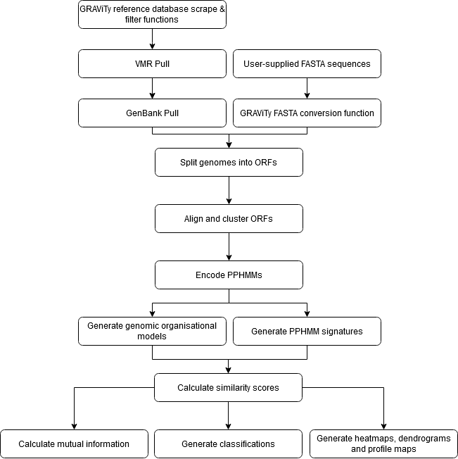

[](https://doi.org/10.5281/zenodo.13911725)

<a href="https://hub.docker.com/r/mayne941/gravityv2"> Try GRAViTy-V2 with Docker @ DockerHub</a>
```
   _____ _____       __      ___ _______     __      _____
  / ____|  __ \     /\ \    / (_)__   __|    \ \    / /__ \
 | |  __| |__) |   /  \ \  / / _   | |_   _   \ \  / /   ) |
 | | |_ |  _  /   / /\ \ \/ / | |  | | | | |   \ \/ /   / /
 | |__| | | \ \  / ____ \  /  | |  | | |_| |    \  /   / /_
  \_____|_|  \_\/_/    \_\/   |_|  |_|\__, |     \/   |____|
                                       __/ |
                                      |___/
 ```
GRAViTy-V2 is a viral taxonomy application developed by Richard Mayne, Pakorn Aiewsakun, Dann Turner, Evelien Adriaenssens and Peter Simmonds.

Please cite:

<div class="csl-entry">Mayne, R., Aiewsakun, P., Turner, D., Adriaenssens, E. M., &#38; Simmonds, P. (2024). GRAViTy-V2: a grounded viral taxonomy application. <i>NAR Genomics and Bioinformatics</i>, <i>6</i>(4). <a href=https://doi.org/10.1093/nargab/lqae183>https://doi.org/10.1093/nargab/lqae183</a></div>

# New with version 2.2
* Features
   * Genbank accessions now automatically extracted from fasta file headers on fasta > VMR/Genbank conversion functions.
* Fixes
   * Parallelisation now functions as per user instructions on "update classification" pipelines.
   * Unnamed index columns are no longer created by VMR filtering functions.
   * Matplotlib backend pinned
   * First pass filter function now subsets to expected fraction

# [Documentation](https://github.com/Mayne941/gravity2/wiki)
GRAViTy-V2 documentation is hosted on our [GitHub Wiki Page](https://github.com/Mayne941/gravity2/wiki)
## [Installation](https://github.com/Mayne941/gravity2/wiki/Installation)
## [Quick start](https://github.com/Mayne941/gravity2/wiki/Quick-start)
## [Usage](https://github.com/Mayne941/gravity2/wiki/Usage)
## [Output file interpretation](https://github.com/Mayne941/gravity2/wiki/Output-file-interpretation)
## [Troubleshooting](https://github.com/Mayne941/gravity2/wiki/Troubleshooting)
## [Advanced usage options](https://github.com/Mayne941/gravity2/wiki/Advanced-usage)
## [Guide for contributors](https://github.com/Mayne941/gravity2/wiki/Guide-for-contributors)


# Background
GRAViTy (genome relationships applied to virus taxonomy) is a framework for identifying and classifying virus genomes. GRAViTyV2 is a development on the original framework written in Python 3, which builds in manifold optimizations, wider support, machine learning component refinements, an interactive API, Docker container compatibility, automatic acquisition and filtering of virus metadata resource (VMR) files and a different workflow.

The software as provided may either be run from the shell/other command line, or through using a browser-based GUI.

In spite of best efforts to simplify the user experience, GRAViTy-V2 is a complex piece of software: please read the [**user guide**](https://github.com/Mayne941/gravity2/wiki) and journal article before use, as this will likely help you to achieve optimal results and reduce software run time.



# Update History
## V2.1
* Features
   * Logscale dendrograms
   * Support for pulling sequences with accession numbers in bacteriophage and provirus styles (e.g. JAEILC010000038 / AE006468 (2844298.2877981))
* Bug fixes
   * When a partially complete genbank file is provided, all sequences of segmented viruses are now pulled
   * Significant compute time reduction on Mash call (thanks to contributor @xvazquezc)
* Continued development on unit test suite (app.utils now has >80% test coverage)

## V2.0
* New expanded readme on our Wiki
* Enhanced stand-alone CLI (see [Quick start](https://github.com/Mayne941/gravity2/wiki/Quick-start))
* <a href="https://hub.docker.com/r/mayne941/gravityv2"> Try our new Docker container with DockerHub</a> (see [Advanced usage options](https://github.com/Mayne941/gravity2/wiki/Advanced) for guidance)
* PyTest suite


## Disclaimer
The material embodied in this software is provided to you "as-is", “with all faults”, and without warranty of any kind, express, implied or otherwise, including without limitation, any warranty of fitness for a particular purpose, warranty of non-infringement, or warranties of any kind concerning the safety, suitability, lack of viruses, inaccuracies, or other harmful components of this software. There are inherent dangers in the use of any software, and you are solely responsible for determining whether this software is compatible with your equipment and other software installed on your equipment. You are convert_fasta_to_genbankalso solely responsible for the protection of your equipment and backup of your data, and the developers/providers will not be liable for any damages you may suffer in connection with using, modifying, or distributing this software. Without limiting the foregoing, the developers/providers make no warranty that: the software will meet your requirements; the software will be uninterrupted, timely, secure, or error-free; the results that may be obtained from the use of the software will be effective, accurate, or reliable; the quality of the software will meet your expectations; any errors in the software will be identified or corrected.

Software and its documentation made available here could include technical or other mistakes, inaccuracies, or typographical errors. The developers/providers may make changes to the software or documentation made available here may be out of date, and the developers/providers make no commitment to update such materials.

The developers/providers assume no responsibility for errors or omissions in the software or documentation available from here.

In no event shall the developers/providers be liable to you or anyone else for any direct, special, incidental, indirect, or consequential damages of any kind, or any damages whatsoever, including without limitation, loss of data, loss of profit, loss of use, savings or revenue, or the claims of third parties, whether or not the developers/providers have been advised of the possibility of such damages and loss, however caused, and on any theory of liability, arising out of or in connection with the possession, use, or performance of this software.

The use of this software is done at your own discretion and risk and with agreement that you will be solely responsible for any damage to your computer system, or networked devices, or loss of data that results from such activities. No advice or information, whether oral or written, obtained by you from the developers/providers shall create any warranty for the software.
